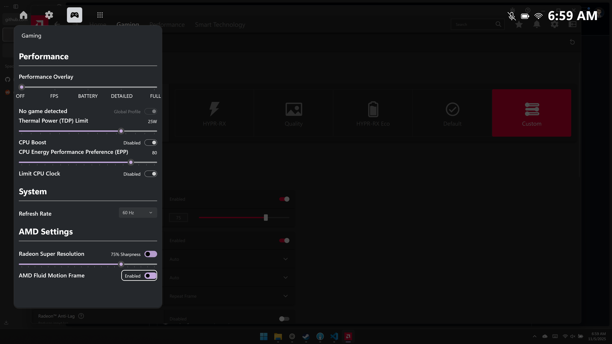

# Xbox Gaming Bar

## What is it?

XBox Gaming Bar is a helper tool for gamers to control all gaming-related settings using the gamepad/game controller.
Xbox Gaming Bar is built as a Xbox Game Bar widget as the frontend, and a Win32 helper as the backend tool.
As of now, there are following functions:
- Performance Overlay using RivaTuner Statistics Server OSD.
- TDP Limit.
- Per-game Profile.
- CPU performance adjustments.
  - Enable or disable CPU Boost.
  - Set CPU Energy Performance Preference (EPP).
  - Set CPU clock speed limit.
- AMD Settings.
  - Radeon Super Resolution.
  - AMD Fluid Motion Frame.

## Installation

Please follow our [Wiki](https://github.com/namquang93/XboxGamingBar/wiki/Installation-Instruction) page for installation instruction.

## Language

Xbox Gaming Bar is 100% free and open source. It's built upon C#.
Libraries used:
- LibreHardwareMonitor for performance statistics overlay.
- RyzenAdj for AMD TDP control.