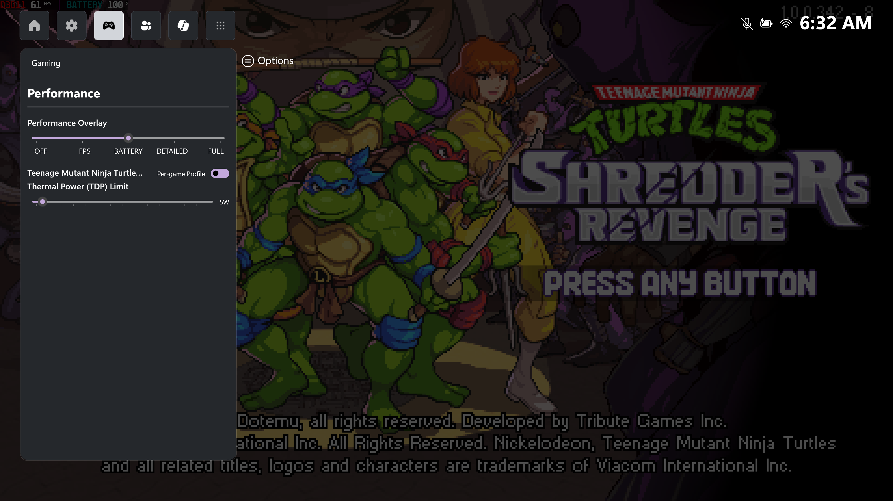

# Xbox Gaming Bar

## What is it?

XBox Gaming Bar is a helper tool for gamers to control all gaming-related settings using the gamepad/game controller.
Xbox Gaming Bar is built as a Xbox Game Bar widget as the frontend, and a Win32 helper as the backend tool.
As of now, there are 2 functions:
1. Performance Overlay using RivaTuner Statistics Server OSD.
2. TDP Limit.
3. Per-game Profile.

## Language

Xbox Gaming Bar is 100% free and open source. It's built upon C#.
Libraries used:
- LibreHardwareMonitor for performance statistics overlay.
- RyzenAdj for AMD TDP control.